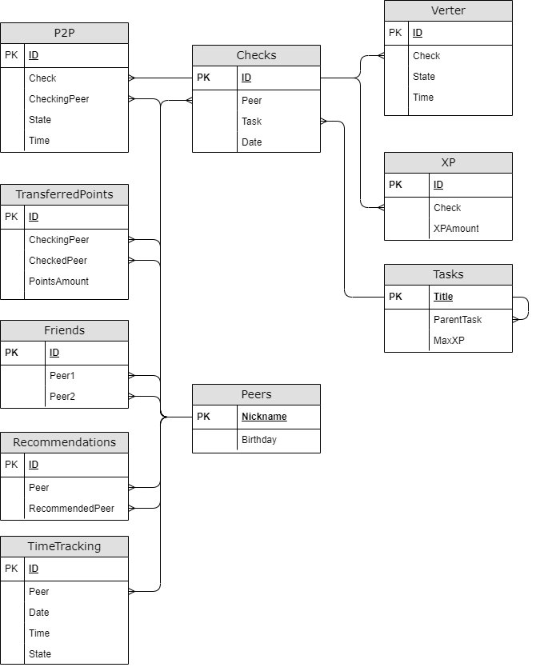

# InsideWorks

## Logical view of database model

*All fields in the table descriptions are listed in the same order as in the schema.*

#### Peers table

- Peer’s nickname
- Birthday

#### Tasks table

- Name of the task
- Name of the task, which is the entry condition
- Maximum number of XP

To access the task, you must complete the task that is its entry condition.
For simplicity, assume that each task has only one entry condition.
There must be one task in the table that has no entry condition (i.e., the ParentTask field is null).

#### Check status

Create an enumeration type for the check status that contains the following values:
- Start - the check starts
- Success - successful completion of the check
- Failure - unsuccessful completion of the check

#### P2P Table

- ID
- Check ID
- Nickname of the checking peer
- [P2P check status](#check-status)
- Time

Each P2P check consists of 2 table records: the first has a start status, the second has a success or failure status. \
The table cannot contain more than one incomplete P2P check related to a specific task, a peer and a checking peer. \
Each P2P check (i.e. both records of which it consists) refers to the check in the Checks table to which it belongs. 

#### Verter Table

- ID
- Check ID
- [Check status by Verter](#check-status)
- Time

Each check by Verter consists of 2 table records: the first has a start status, the second has a success or failure status. \
Each check by Verter (i.e. both records of which it consists) refers to the check in the Checks table to which it belongs. \
Сheck by Verter can only refer to those checks in the Checks table that already include a successful P2P check.

#### Checks table

- ID
- Peer’s nickname
- Name of the task
- Check date

Describes the check of the task as a whole. The check necessarily includes a **one** P2P step and possibly a Verter step.
For simplicity, assume that peer to peer and autotests related to the same check always happen on the same day.

The check is considered successful if the corresponding P2P step is successful and the Verter step is successful, or if there is no Verter step.
The check is considered a failure if at least one of the steps is unsuccessful. This means that checks in which the P2P step has not yet been completed, or it is successful but the Verter step has not yet been completed, are neither successful nor failed.

#### TransferredPoints table

- ID
- Nickname of the checking peer
- Nickname of the peer being checked
- Number of transferred peer points for all time (only from the one being checked to the checker)

At each P2P check, the peer being checked passes one peer point to the checker.
This table contains all pairs of the peer being checked-the checker and the number of transferred peer points, that is the number of P2P checks of the specified peer by the specified checker.

#### Friends table

- ID
- Nickname of the first peer
- Nickname of the second peer

Friendship is mutual, i.e. the first peer is a friend of the second one, and vice versa.

#### Recommendations table

- ID
- Nickname of the peer
- Nickname of the peer to whom it is recommended to go for the check

Everyone can like how the P2P check was performed by a particular peer. The peer specified in the Peer field recommends passing the P2P check from the peer in the RecommendedPeer field. 
Each peer can recommend either one or several checkers at a time.

#### XP Table

- ID
- Check ID
- Number of XP received

For each successful check, the peer who completes the task receives some amount of XP displayed in this table.
The amount of XP cannot exceed the maximum available number for the task being checked.
The first field of this table can only refer to successful checks.

#### TimeTracking table

- ID
- Peer's nickname
- Date
- Time
- State (1 - in, 2 - out)

This table contains information about peers' visits to campus.
When a peer enters campus, a record is added to the table with state 1, when leaving it adds a record with state 2. 

In tasks related to this table, the "out" action refers to all but the last Campus departure of the day.
There must be the same number of records with state 1 and state 2 for each peer during one day.

For example:

| ID | Peer | Date   | Time | State |
|---|------|--------|------|---|
| 1 | Aboba | 22.03.22 | 13:37 | 1 |
| 2 | Aboba | 22.03.22 | 15:48 | 2 |
| 3 | Aboba | 22.03.22 | 16:02 | 1 |
| 4 | Aboba | 22.03.22 | 20:00 | 2 |

In this example, the only "out" is the record with an ID equal to 2. Peer with the nickname Aboba has been out of campus for 14 minutes.

## Chapter III

## Part 1. Creating a database

Write a *part1.sql* script that creates the database and all the tables described above.

Also, add procedures to the script that allow you to import and export data for each table from/to a file with a *.csv* extension. \
The *csv* file separator is specified as a parameter of each procedure.

## Part 2. Changing data

##### 1) Write a procedure for adding P2P check
Parameters: nickname of the person being checked, checker's nickname, task name, [P2P check status]( #check-status), time. \
If the status is "start", add a record in the Checks table (use today's date). \
Add a record in the P2P table. \
If the status is "start", specify the record just added as a check, otherwise specify the check with the unfinished P2P step.

##### 2) Write a procedure for adding checking by Verter
Parameters: nickname of the person being checked, task name, [Verter check status](#check-status), time. \
Add a record to the Verter table (as a check specify the check of the corresponding task with the latest (by time) successful P2P step)

##### 3) Write a trigger: after adding a record with the "start" status to the P2P table, change the corresponding record in the TransferredPoints table

##### 4) Write a trigger: before adding a record to the XP table, check if it is correct
The record is considered correct if:
- The number of XP does not exceed the maximum available for the task being checked
- The Check field refers to a successful check
If the record does not pass the check, do not add it to the table.

### Part 3. Getting data

##### 1) Write a function that returns the TransferredPoints table in a more human-readable form
Peer's nickname 1, Peer's nickname 2, number of transferred peer points. \
The number is negative if peer 2 received more points from peer 1.

Output example:

| Peer1 | Peer2 | PointsAmount |
|------|------|----|
| Aboba | Amogus | 5  |
| Amogus | Sus  | -2 |
| Sus  | Aboba | 0  |

##### 2) Write a function that returns a table of the following form: user name, name of the checked task, number of XP received
Include in the table only tasks that have successfully passed the check (according to the Checks table). \
One task can be completed successfully several times. In this case, include all successful checks in the table.

Output example:

| Peer   | Task | XP  |
|--------|------|-----|
| Aboba  | C8   | 800 |
| Aboba  | CPP3 | 750 |
| Amogus | DO5  | 175 |
| Sus    | A4   | 325 |

##### 3) Write a function that finds the peers who have not left campus for the whole day
Function parameters: day, for example 12.05.2022. \
The function returns only a list of peers.

##### 4) Calculate the change in the number of peer points of each peer using the TransferredPoints table
Output the result sorted by the change in the number of points. \
Output format: peer's nickname, change in the number of peer points

Output example:
| Peer   | PointsChange |
|--------|--------------|
| Aboba  | 8            |
| Amogus | 1            |
| Sus    | -3           |

##### 5) Calculate the change in the number of peer points of each peer using the table returned by [the first function from Part 3](#1-write-a-function-that-returns-the-transferredpoints-table-in-a-more-human-readable-form)
Output the result sorted by the change in the number of points. \
Output format: peer's nickname, change in the number of peer points

Output example:
| Peer   | PointsChange |
|--------|--------------|
| Aboba  | 8            |
| Amogus | 1            |
| Sus    | -3           |

##### 6) Find the most frequently checked task for each day
If there is the same number of checks for some tasks in a certain day, output all of them. \
Output format: day, task name

Output example:
| Day        | Task |
|------------|------|
| 12.05.2022 | A1   |
| 17.04.2022 | CPP3 |
| 23.12.2021 | C5   |

##### 7) Find all peers who have completed the whole given block of tasks and the completion date of the last task
Procedure parameters: name of the block, for example “CPP”. \
The result is sorted by the date of completion. \
Output format: peer's name, date of completion of the block (i.e. the last completed task from that block)

Output example:
| Peer   | Day        |
|--------|------------|
| Sus    | 23.06.2022 |
| Amogus | 17.05.2022 |
| Aboba  | 12.05.2022 |

##### 8) Determine which peer each student should go to for a check.
You should determine it according to the recommendations of the peer's friends, i.e. you need to find the peer with the greatest number of friends who recommend to be checked by him. \
Output format: peer's nickname, nickname of the checker found

Output example:
| Peer   | RecommendedPeer  |
|--------|-----------------|
| Aboba  | Sus             |
| Amogus | Aboba           |
| Sus    | Aboba           |

##### 9) Determine the percentage of peers who:
- Started only block 1
- Started only block 2
- Started both
- Have not started any of them

A peer is considered to have started a block if he has at least one check of any task from this block (according to the Checks table)

Procedure parameters: name of block 1, for example SQL, name of block 2, for example A. \
Output format: percentage of those who started only the first block, percentage of those who started only the second block, percentage of those who started both blocks, percentage of those who did not started any of them

Output example:
| StartedBlock1 | StartedBlock2 | StartedBothBlocks | DidntStartAnyBlock |
|---------------|---------------|-------------------|--------------------|
| 20            | 20            | 5                 | 55                 |

##### 10) Determine the percentage of peers who have ever successfully passed a check on their birthday
Also determine the percentage of peers who have ever failed a check on their birthday. \
Output format: percentage  of peers who have ever successfully passed a check on their birthday, percentage of peers who have ever failed a check on their birthday

Output example:
| SuccessfulChecks | UnsuccessfulChecks |
|------------------|--------------------|
| 60               | 40                 |

##### 11) Determine all peers who did the given tasks 1 and 2, but did not do task 3
Procedure parameters: names of tasks 1, 2 and 3. \
Output format: list of peers

##### 12) Using recursive common table expression, output the number of preceding tasks for each task
I. e. How many tasks have to be done, based on entry conditions, to get access to the current one. \
Output format: task name, number of preceding tasks

Output example:
| Task | PrevCount |
|------|-----------|
| CPP3 | 7         |
| A1   | 9         |
| C5   | 1         |

##### 13) Find "lucky" days for checks. A day is considered "lucky" if it has at least *N* consecutive successful checks
Parameters of the procedure: the *N* number of consecutive successful checks . \
The time of the check is the start time of the P2P step. \
Successful consecutive checks are the checks with no unsuccessful checks in between. \
The amount of XP for each of these checks must be at least 80% of the maximum. \
Output format: list of days

##### 14) Find the peer with the highest amount of XP
Output format: peer's nickname, amount of XP

Output example:
| Peer   | XP    |
|--------|-------|
| Amogus | 15000 |

##### 15) Determine the peers that came before the given time at least *N* times during the whole time
Procedure parameters: time, *N* number of times . \
Output format: list of peers

##### 16) Determine the peers who left the campus more than *M* times during the last *N* days
Procedure parameters: *N* number of days , *M* number of times . \
Output format: list of peers

##### 17) Determine for each month the percentage of early entries
For each month, count how many times people born in that month came to campus during the whole time (we'll call this the total number of entries). \
For each month, count the number of times people born in that month have come to campus before 12:00 in all time (we'll call this the number of early entries). \
For each month, count the percentage of early entries to campus relative to the total number of entries. \
Output format: month, percentage of early entries

Output example:

| Month    | EarlyEntries |
|----------|--------------|
| January  | 15           |
| February | 35           |
| March    | 45           |

## Bonus. Part 4. Metadata

For this part of the task, you need to create a separate database, in which to create the tables, functions, procedures, and triggers needed to test the procedures.

##### 1) Create a stored procedure that, without destroying the database, destroys all those tables in the current database whose names begin with the phrase 'TableName'.

##### 2) Create a stored procedure with an output parameter that outputs a list of names and parameters of all scalar user's SQL functions in the current database. Do not output function names without parameters. The names and the list of parameters must be in one string. The output parameter returns the number of functions found.

##### 3) Create a stored procedure with output parameter, which destroys all SQL DML triggers in the current database. The output parameter returns the number of destroyed triggers.

##### 4) Create a stored procedure with an input parameter that outputs names and descriptions of object types (only stored procedures and scalar functions) that have a string specified by the procedure parameter.

